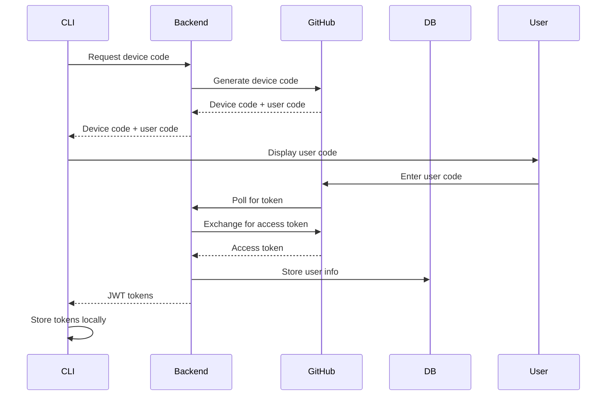
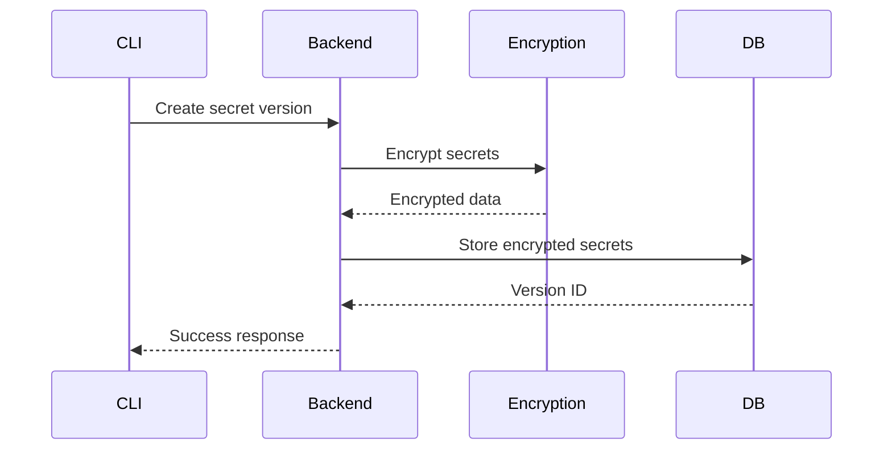
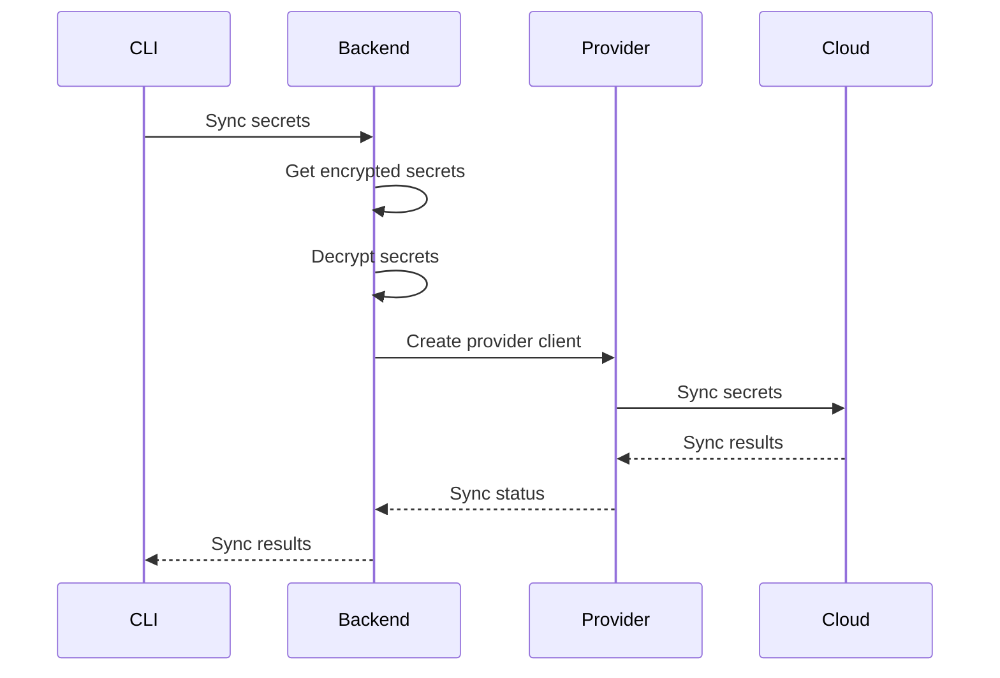

# Architecture Overview

Kavach is designed as a modern, cloud-native secret management platform with a focus on security, scalability, and developer experience. This document provides a comprehensive overview of the system architecture.

## System Components

Kavach consists of two main components that work together to provide a complete secret management solution:

### 1. Backend Server (`kavach-backend`)

The backend server is the core of the Kavach platform, providing:

- **RESTful API** - HTTP endpoints for all operations
- **Authentication & Authorization** - JWT-based auth with RBAC
- **Secret Management** - Encrypted storage with versioning
- **Provider Integration** - Cloud platform synchronization
- **Database Layer** - PostgreSQL with SQLC for type safety

### 2. CLI Tool (`kavach-cli`)

The CLI provides a developer-friendly interface:

- **Command Interface** - Cobra-based CLI framework
- **HTTP Client** - RESTful API communication
- **Authentication** - Device code flow with GitHub OAuth
- **Configuration Management** - Local config and credentials

## High-Level Architecture

```
┌─────────────────┐    ┌─────────────────┐    ┌─────────────────┐
│   CLI Client    │    │  Backend API    │    │   Database      │
│                 │    │                 │    │                 │
│ ┌─────────────┐ │    │ ┌─────────────┐ │    │ ┌─────────────┐ │
│ │   Cobra     │ │    │ │    Gin      │ │    │ │ PostgreSQL  │ │
│ │   CLI       │ │◄──►│ │   Server    │ │◄──►│ │   Database  │ │
│ └─────────────┘ │    │ └─────────────┘ │    │ └─────────────┘ │
│ ┌─────────────┐ │    │ ┌─────────────┐ │    │ ┌─────────────┐ │
│ │   HTTP      │ │    │ │   JWT       │ │    │ │   SQLC      │ │
│ │   Client    │ │    │ │   Auth      │ │    │ │   Queries   │ │
│ └─────────────┘ │    │ └─────────────┘ │    │ └─────────────┘ │
└─────────────────┘    │ ┌─────────────┐ │    └─────────────────┘
                       │ │   Casbin    │ │
                       │ │    RBAC     │ │
                       │ └─────────────┘ │
                       │ ┌─────────────┐ │
                       │ │ Encryption  │ │
                       │ │   Service   │ │
                       │ └─────────────┘ │
                       └─────────────────┘
                                │
                                ▼
                       ┌─────────────────┐
                       │  Cloud Providers│
                       │                 │
                       │ ┌─────────────┐ │
                       │ │   GitHub    │ │
                       │ └─────────────┘ │
                       │ ┌─────────────┐ │
                       │ │     GCP     │ │
                       │ └─────────────┘ │
                       │ ┌─────────────┐ │
                       │ │    Azure    │ │
                       │ └─────────────┘ │
                       └─────────────────┘
```

## Data Flow

### 1. Authentication Flow



### 2. Secret Management Flow



### 3. Provider Sync Flow



## Security Architecture

### 1. Authentication

- **GitHub OAuth** - Device code flow for CLI authentication
- **JWT Tokens** - Access and refresh token mechanism
- **Token Storage** - Encrypted local storage for CLI credentials

### 2. Authorization

- **Casbin RBAC** - Role-based access control
- **Resource Hierarchy** - Organization → Secret Group → Environment
- **Permission Model** - Granular permissions for each resource type

### 3. Encryption

- **AES-256** - Encryption for secrets and provider credentials
- **Key Management** - Separate encryption keys for secrets and providers
- **Zero-Knowledge** - Backend cannot decrypt secrets without proper authorization

## Database Schema

### Core Tables

```sql
-- Users (GitHub OAuth)
users (
  id UUID PRIMARY KEY,
  provider TEXT NOT NULL,
  provider_id TEXT NOT NULL,
  email TEXT,
  name TEXT,
  avatar_url TEXT,
  created_at TIMESTAMPTZ,
  updated_at TIMESTAMPTZ
)

-- Organizations
organizations (
  id UUID PRIMARY KEY,
  name TEXT UNIQUE NOT NULL,
  description TEXT,
  owner_id UUID REFERENCES users(id),
  created_at TIMESTAMP,
  updated_at TIMESTAMP
)

-- Secret Groups
secret_groups (
  id UUID PRIMARY KEY,
  name TEXT NOT NULL,
  description TEXT,
  organization_id UUID REFERENCES organizations(id),
  created_at TIMESTAMP,
  updated_at TIMESTAMP
)

-- Environments
environments (
  id UUID PRIMARY KEY,
  name TEXT NOT NULL,
  description TEXT,
  secret_group_id UUID REFERENCES secret_groups(id),
  created_at TIMESTAMP,
  updated_at TIMESTAMP
)

-- Secret Versions
secret_versions (
  id VARCHAR(8) PRIMARY KEY,
  environment_id UUID REFERENCES environments(id),
  commit_message TEXT NOT NULL,
  created_at TIMESTAMPTZ
)

-- Secrets
secrets (
  id UUID PRIMARY KEY,
  version_id VARCHAR(8) REFERENCES secret_versions(id),
  name TEXT NOT NULL,
  value_encrypted BYTEA NOT NULL
)

-- Provider Credentials
provider_credentials (
  id UUID PRIMARY KEY,
  environment_id UUID REFERENCES environments(id),
  provider TEXT NOT NULL,
  credentials_encrypted BYTEA NOT NULL,
  config JSONB NOT NULL,
  created_at TIMESTAMP,
  updated_at TIMESTAMP
)
```

### Authorization Tables

```sql
-- Role Bindings
role_bindings (
  id UUID PRIMARY KEY,
  user_id UUID REFERENCES users(id),
  resource_type TEXT NOT NULL,
  resource_id UUID NOT NULL,
  role TEXT NOT NULL,
  created_at TIMESTAMP
)

-- User Groups
user_groups (
  id UUID PRIMARY KEY,
  name TEXT NOT NULL,
  organization_id UUID REFERENCES organizations(id),
  created_at TIMESTAMP
)

-- User Group Members
user_group_members (
  id UUID PRIMARY KEY,
  user_group_id UUID REFERENCES user_groups(id),
  user_id UUID REFERENCES users(id),
  created_at TIMESTAMP
)
```

## API Design

### RESTful Endpoints

```
/api/v1/
├── auth/
│   ├── device/code          # Get device code
│   ├── device/token         # Exchange for tokens
│   └── refresh              # Refresh access token
├── organizations/
│   ├── /                   # List/Create organizations
│   ├── /{id}               # Get/Update/Delete organization
│   ├── /{id}/members       # Manage organization members
│   └── /{id}/secret-groups # List secret groups
├── secret-groups/
│   ├── /                   # List/Create secret groups
│   ├── /{id}               # Get/Update/Delete secret group
│   ├── /{id}/environments  # List environments
│   └── /{id}/members       # Manage secret group members
├── environments/
│   ├── /                   # List/Create environments
│   ├── /{id}               # Get/Update/Delete environment
│   ├── /{id}/secrets/      # Secret management
│   └── /{id}/providers/    # Provider management
└── user-groups/
    ├── /                   # List/Create user groups
    ├── /{id}               # Get/Update/Delete user group
    └── /{id}/members       # Manage user group members
```

### Authentication Headers

```http
Authorization: Bearer <jwt_token>
Content-Type: application/json
```

### Response Format

```json
{
  "success": true,
  "data": {
    // Response data
  },
  "error": null,
  "error_code": null
}
```

## Scalability Considerations

### 1. Horizontal Scaling

- **Stateless Backend** - Multiple instances can run simultaneously
- **Database Connection Pooling** - Efficient database connections
- **Load Balancing** - Support for load balancers and reverse proxies

### 2. Performance

- **Connection Pooling** - Database connection reuse
- **Caching** - JWT token validation caching
- **Batch Operations** - Efficient bulk secret operations

### 3. Reliability

- **Database Transactions** - ACID compliance for data integrity
- **Error Handling** - Comprehensive error handling and logging
- **Health Checks** - Built-in health check endpoints

## Deployment Architecture

### Development

```
┌─────────────────┐    ┌─────────────────┐    ┌─────────────────┐
│   CLI Client    │    │  Backend API    │    │   PostgreSQL    │
│   (Local)       │◄──►│   (Local:8080)  │◄──►│   (Local:5432)  │
└─────────────────┘    └─────────────────┘    └─────────────────┘
```

### Production

```
┌─────────────────┐    ┌─────────────────┐    ┌─────────────────┐
│   Load Balancer │    │  Backend API    │    │   PostgreSQL    │
│   (Nginx/ALB)   │◄──►│   (Multiple)    │◄──►│   (RDS/Cloud)   │
└─────────────────┘    └─────────────────┘    └─────────────────┘
                                │
                                ▼
                       ┌─────────────────┐
                       │  Cloud Providers│
                       │   (GitHub/GCP)  │
                       └─────────────────┘
```

## Technology Stack

### Backend

- **Language**: Go 1.21+
- **Framework**: Gin (HTTP server)
- **Database**: PostgreSQL 14+
- **ORM**: SQLC (type-safe SQL)
- **Authentication**: JWT + GitHub OAuth
- **Authorization**: Casbin RBAC
- **Encryption**: AES-256-GCM

### CLI

- **Language**: Go 1.21+
- **Framework**: Cobra (CLI)
- **HTTP Client**: Standard library
- **Configuration**: Viper + YAML
- **Authentication**: Device code flow

### Infrastructure

- **Containerization**: Docker
- **Orchestration**: Docker Compose (dev), Kubernetes (prod)
- **Database**: PostgreSQL with pgcrypto extension
- **Monitoring**: Structured logging with logrus

## Next Steps

- 🏗️ [Backend Architecture](/docs/architecture/backend) - Detailed backend design
- 💻 [CLI Architecture](/docs/architecture/cli) - CLI design patterns
- 🗄️ [Database Design](/docs/architecture/database) - Database schema details
- 🔒 [Security Architecture](/docs/architecture/security) - Security implementation
- 🚀 [Deployment Guide](/docs/guides/deployment) - Production deployment 