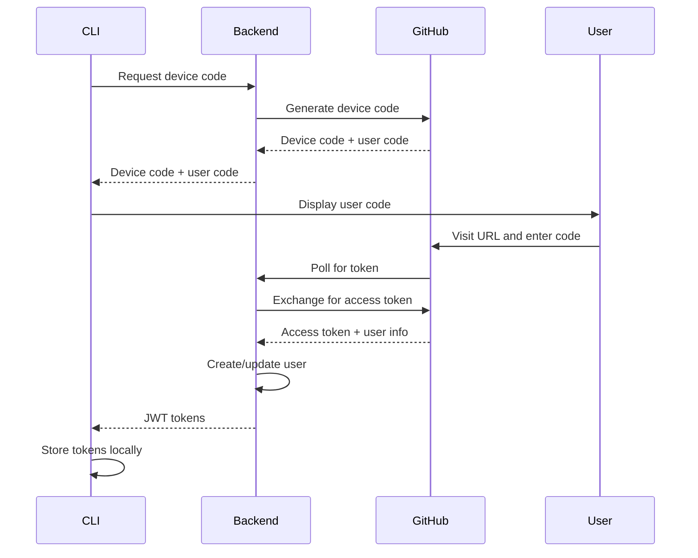

# CLI Authentication

Kavach CLI uses GitHub OAuth for authentication via the device code flow, providing a secure and user-friendly authentication experience.

## Authentication Flow

Kavach CLI implements the OAuth 2.0 Device Authorization Grant flow, which is ideal for CLI applications:



## Login Process

### Step 1: Initiate Login

```bash
kavach login
```

### Step 2: Follow the Device Code Flow

The CLI will display a message similar to:

```
🔐 Authenticating with Kavach...

To complete authentication, please visit:
https://github.com/login/device

And enter the code: ABC-DEF-GHI

Waiting for authentication...
```

### Step 3: Complete Authentication

1. **Visit the URL**: Open `https://github.com/login/device` in your browser
2. **Enter the Code**: Type the displayed code (e.g., `ABC-DEF-GHI`)
3. **Authorize Kavach**: Grant the requested permissions to Kavach
4. **Wait for Completion**: The CLI will automatically detect successful authentication

### Step 4: Verification

```bash
# Check authentication status
kavach status

# View user information
kavach info
```

## Token Management

### Token Storage

Authentication tokens are stored securely in `~/.kavach/credentials.json`:

```json
{
  "access_token": "eyJhbGciOiJIUzI1NiIsInR5cCI6IkpXVCJ9...",
  "refresh_token": "eyJhbGciOiJIUzI1NiIsInR5cCI6IkpXVCJ9...",
  "expires_at": "2024-01-15T10:30:00Z",
  "user": {
    "id": "12345678",
    "name": "John Doe",
    "email": "john@example.com",
    "avatar_url": "https://avatars.githubusercontent.com/u/12345678"
  }
}
```

### Token Refresh

The CLI automatically handles token refresh:

- **Access tokens** expire after 1 hour
- **Refresh tokens** are used to obtain new access tokens
- **Automatic refresh** happens transparently during API calls

### Manual Token Refresh

```bash
# Force token refresh
kavach login --force
```

## Logout Process

### Clear Authentication

```bash
kavach logout
```

This command:
- Removes stored tokens from `~/.kavach/credentials.json`
- Clears any cached authentication state
- Does not revoke GitHub OAuth permissions

### Revoke GitHub Permissions

To completely revoke Kavach's access to your GitHub account:

1. Visit [GitHub OAuth Applications](https://github.com/settings/applications)
2. Find "Kavach" in the list
3. Click "Revoke" to remove access

## Authentication States

### Authenticated

```bash
$ kavach status
✅ Authenticated as: John Doe (john@example.com)
🏢 Active Organization: my-company
🔐 Active Secret Group: backend
🌍 Active Environment: development
```

### Not Authenticated

```bash
$ kavach status
❌ Not authenticated
Please run 'kavach login' to authenticate
```

### Token Expired

```bash
$ kavach status
⚠️  Authentication expired
Please run 'kavach login' to re-authenticate
```

## GitHub Permissions

Kavach requests the following GitHub OAuth scopes:

| Scope | Purpose |
|-------|---------|
| `read:user` | Read user profile information |
| `user:email` | Read user email addresses |

### Minimal Permissions

Kavach follows the principle of least privilege:
- **No write access** to your repositories
- **No access** to private repositories
- **No access** to organization data
- **Read-only** access to public profile information

## Security Considerations

### Token Security

- **Local Storage**: Tokens are stored in user's home directory
- **File Permissions**: Credentials file has restricted permissions (600)
- **Encryption**: Consider using OS-level encryption for the credentials file

### Network Security

- **HTTPS Only**: All communication uses HTTPS
- **Certificate Validation**: Full SSL certificate validation
- **No Credential Transmission**: Passwords are never transmitted

### Best Practices

1. **Regular Logout**: Logout when switching between accounts
2. **Secure Environment**: Use on trusted machines only
3. **Token Rotation**: Re-authenticate periodically
4. **Monitor Access**: Review GitHub OAuth applications regularly

## Troubleshooting

### Common Issues

#### 1. Device Code Expired

```bash
# Error: Device code expired
# Solution: Request a new code
kavach login
```

#### 2. Network Connectivity

```bash
# Error: Network connectivity issues
# Solution: Check network and firewall
curl -I https://kavach.gkem.cloud/healthz
```

#### 3. GitHub Rate Limiting

```bash
# Error: GitHub API rate limit exceeded
# Solution: Wait and retry
sleep 60
kavach login
```

#### 4. Invalid Backend URL

```bash
# Error: Invalid backend endpoint
# Solution: Check configuration
export KAVACH_BACKEND_ENDPOINT="https://kavach.gkem.cloud/api/v1/"
kavach login
```

### Debug Authentication

Enable debug logging for authentication troubleshooting:

```bash
# Run with debug logging
kavach --debug login

# Check log files
tail -f ~/.kavach/logs/kavach.log
```

### Manual Token Inspection

```bash
# View stored tokens (for debugging)
cat ~/.kavach/credentials.json | jq .

# Check token expiration
cat ~/.kavach/credentials.json | jq -r '.expires_at'
```

## Multi-Account Support

### Switching Accounts

```bash
# Logout from current account
kavach logout

# Login with different account
kavach login
```

### Account Verification

```bash
# Check current user
kavach info

# Verify organization access
kavach org list
```

## Environment-Specific Configuration

### Development Environment

```bash
# Use local backend
export KAVACH_BACKEND_ENDPOINT="http://localhost:8080/api/v1/"
export KAVACH_DEVICE_CODE_URL="http://localhost:8080/api/v1/auth/device/code"
export KAVACH_DEVICE_TOKEN_URL="http://localhost:8080/api/v1/auth/device/token"

kavach login
```

### Production Environment

```bash
# Use production backend
export KAVACH_BACKEND_ENDPOINT="https://kavach.gkem.cloud/api/v1/"
export KAVACH_DEVICE_CODE_URL="https://kavach.gkem.cloud/api/v1/auth/device/code"
export KAVACH_DEVICE_TOKEN_URL="https://kavach.gkem.cloud/api/v1/auth/device/token"

kavach login
```

## API Authentication

### HTTP Headers

The CLI automatically includes authentication headers in API requests:

```http
Authorization: Bearer <jwt_access_token>
Content-Type: application/json
User-Agent: Kavach-CLI/1.0.0
```

### Token Validation

The backend validates tokens on each request:
- **Signature verification** using JWT secret
- **Expiration check** against current time
- **User validation** against database records

## Next Steps

After successful authentication:

1. **Create Organization**: [Organization Management](/docs/cli/overview#organization-commands)
2. **Set Up Infrastructure**: [Secret Groups and Environments](/docs/cli/overview#secret-group-commands)
3. **Manage Secrets**: [Secret Management](/docs/cli/overview#secret-commands)
4. **Configure Providers**: [Provider Integration](/docs/cli/overview#provider-commands)

## Support

For authentication issues:

- 📚 [CLI Reference](/docs/cli/overview) - Complete command documentation
- 🔒 [Security Guide](/docs/security/overview) - Security best practices
- 🐛 [Issues](https://github.com/Gkemhcs/kavach-docs/issues) - Report authentication problems
- 💬 [Discussions](https://github.com/Gkemhcs/kavach-docs/discussions) - Ask for help 