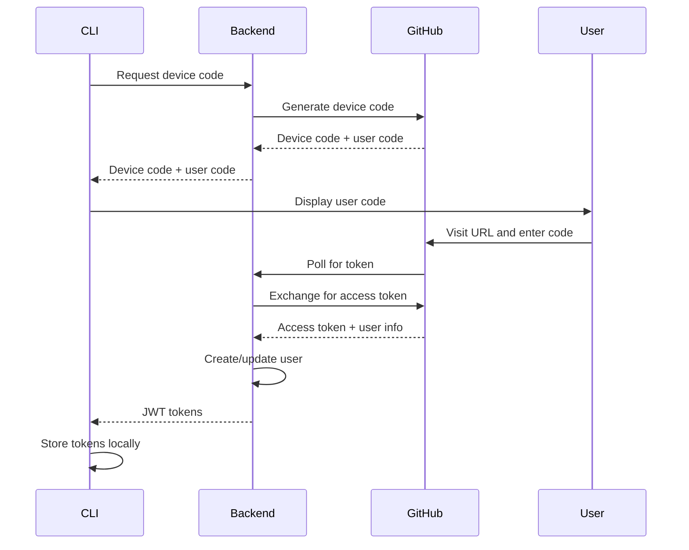

# Authentication Commands

The authentication commands allow you to securely authenticate with Kavach using GitHub OAuth and manage your local credentials.

## Overview

Kavach CLI uses GitHub OAuth for authentication via the device code flow, providing a secure and user-friendly authentication experience. All authentication tokens are stored locally in your home directory.

## Commands

### `kavach login`

🔐 Authenticate with GitHub and save access token

#### Description

Authenticate with GitHub using OAuth device flow and save your access token for CLI use.

This command initiates a secure OAuth authentication flow with GitHub. You'll be prompted to complete device authentication in your browser by visiting a GitHub URL and entering a device code.

#### Authentication Process

1. **Generates a device code** and authorization URL
2. **Opens your browser** to complete GitHub authorization
3. **Waits for you** to authorize the application
4. **Saves the access token** locally for future CLI operations

Your credentials are stored securely in your home directory and are used automatically for all subsequent CLI commands that require authentication.

#### Usage

```bash
kavach login
```

#### Examples

```bash
# Start GitHub authentication
kavach login

# Show detailed help
kavach login --help
```

#### Example Output

```
🔐 Starting login process...🔃
✔️ Successfully logged in to GitHub!
```

#### Error Handling

The command handles various error scenarios:

- **Backend Unreachable**: Displays helpful message with contact information
- **Device Authorization Timeout**: Prompts user to try again
- **Backend Timeout**: Suggests re-authentication

#### Notes

- You only need to run this command once
- The token will be automatically refreshed when needed
- Credentials are stored securely in `~/.kavach/credentials.json`

---

### `kavach logout`

🚪 Log out and remove local credentials

#### Description

Log out from Kavach and remove your locally stored credentials.

This command securely removes your authentication token and other credentials stored locally on your machine. After running this command, you'll need to run `kavach login` again to authenticate for future CLI operations.

#### Logout Process

1. **Removes the stored access token** from your home directory
2. **Clears any cached authentication data**
3. **Ensures you're completely logged out** from the CLI

#### Usage

```bash
kavach logout
```

#### Examples

```bash
# Log out and remove credentials
kavach logout

# Show detailed help
kavach logout --help
```

#### Use Cases

This command is useful when:

- **Switching between different GitHub accounts**
- **Securing your machine** before sharing it
- **Troubleshooting authentication issues**
- **Ensuring complete logout** for security purposes

#### Notes

- This only affects your local CLI credentials
- It doesn't revoke your GitHub OAuth application access
- To completely revoke GitHub access, visit GitHub OAuth Applications settings

---

## Authentication Flow

Kavach CLI implements the OAuth 2.0 Device Authorization Grant flow:



## Token Storage

Authentication tokens are stored securely in `~/.kavach/credentials.json`:

```json
{
  "access_token": "eyJhbGciOiJIUzI1NiIsInR5cCI6IkpXVCJ9...",
  "refresh_token": "eyJhbGciOiJIUzI1NiIsInR5cCI6IkpXVCJ9...",
  "expires_at": "2024-01-15T10:30:00Z",
  "user": {
    "id": "12345678",
    "name": "John Doe",
    "email": "john@example.com",
    "avatar_url": "https://avatars.githubusercontent.com/u/12345678"
  }
}
```

## GitHub Permissions

Kavach requests the following GitHub OAuth scopes:

| Scope | Purpose |
|-------|---------|
| `read:user` | Read user profile information |
| `user:email` | Read user email addresses |

### Minimal Permissions

Kavach follows the principle of least privilege:
- **No write access** to your repositories
- **No access** to private repositories
- **No access** to organization data
- **Read-only** access to public profile information

## Security Considerations

### Token Security

- **Local Storage**: Tokens are stored in user's home directory
- **File Permissions**: Credentials file has restricted permissions (600)
- **Encryption**: Consider using OS-level encryption for the credentials file

### Network Security

- **HTTPS Only**: All communication uses HTTPS
- **Certificate Validation**: Full SSL certificate validation
- **No Credential Transmission**: Passwords are never transmitted

### Best Practices

1. **Regular Logout**: Logout when switching between accounts
2. **Secure Environment**: Use on trusted machines only
3. **Token Rotation**: Re-authenticate periodically
4. **Monitor Access**: Review GitHub OAuth applications regularly

## Troubleshooting

### Common Issues

#### 1. Device Code Expired

```bash
# Error: Device code expired
# Solution: Request a new code
kavach login
```

#### 2. Network Connectivity

```bash
# Error: Network connectivity issues
# Solution: Check network and firewall
curl -I https://kavach.gkem.cloud/healthz
```

#### 3. GitHub Rate Limiting

```bash
# Error: GitHub API rate limit exceeded
# Solution: Wait and retry
sleep 60
kavach login
```


### Manual Token Inspection

```bash
# View stored tokens (for debugging)
cat ~/.kavach/credentials.json | jq .

# Check token expiration
cat ~/.kavach/credentials.json | jq -r '.expires_at'
```

## Multi-Account Support

### Switching Accounts

```bash
# Logout from current account
kavach logout

# Login with different account
kavach login
```

### Account Verification

```bash
# Check current user
kavach status 

# Verify organization access
kavach org list
```

## Environment-Specific Configuration

### Development Environment

```bash
# Use local backend
export KAVACH_BACKEND_ENDPOINT="http://localhost:8080/api/v1/"
export KAVACH_DEVICE_CODE_URL="http://localhost:8080/api/v1/auth/device/code"
export KAVACH_DEVICE_TOKEN_URL="http://localhost:8080/api/v1/auth/device/token"

kavach login
```

### Production Environment

```bash
# Use production backend
export KAVACH_BACKEND_ENDPOINT="https://kavach.gkem.cloud/api/v1/"
export KAVACH_DEVICE_CODE_URL="https://kavach.gkem.cloud/api/v1/auth/device/code"
export KAVACH_DEVICE_TOKEN_URL="https://kavach.gkem.cloud/api/v1/auth/device/token"

kavach login
```

## Next Steps

After successful authentication:

1. **Create Organization**: [Organization Management](/docs/cli/commands/org)
2. **Set Up Infrastructure**: [Secret Groups and Environments](/docs/cli/commands/group)
3. **Manage Secrets**: [Secret Management](/docs/cli/commands/secret)
4. **Configure Providers**: [Provider Integration](/docs/cli/commands/provider)

## Support

For authentication issues:

- 📚 [CLI Reference](/docs/cli/overview) - Complete command documentation
- 🔒 [Security Guide](/docs/security/overview) - Security best practices
- 🐛 [Issues](https://github.com/Gkemhcs/kavach-docs/issues) - Report authentication problems
- 💬 [Discussions](https://github.com/Gkemhcs/kavach-docs/discussions) - Ask for help 